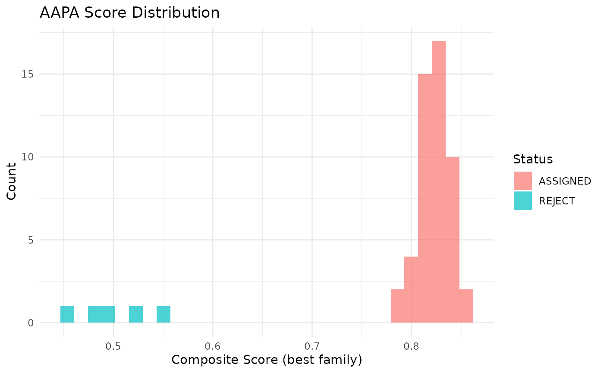
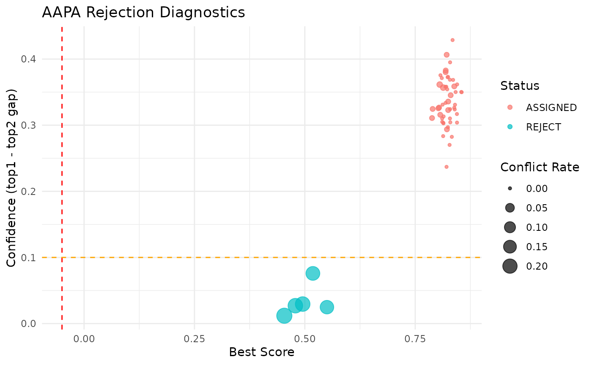

# Getting Started with AAPA

## Introduction

**AAPA** (Anchor-Assisted Pedigree Assignment) is an R package for
high-throughput full-sib family assignment. It is designed for scenarios
where:

- Candidate parents are known (enumerable family set)
- Each family has one or more **anchor individuals** with
  high-confidence family labels
- A large number of test individuals need to be assigned to families (or
  rejected as unknown)

## Quick Start

### 1. Simulate example data

``` r

library(aapa)

sim <- simulate_aapa_data(
  n_families = 5,
  n_snps = 200,
  n_offspring_per_family = 10,
  n_anchors_per_family = 2,
  n_unknown = 5,
  missing_rate = 0.01,
  error_rate = 0.001
)
#> ℹ Simulating data: 5 families, 200 SNPs
#> ✔ Simulated 75 individuals x 200 markers

str(sim, max.level = 1)
#> List of 4
#>  $ genotype   : int [1:75, 1:200] 1 1 1 0 1 2 0 0 2 1 ...
#>   ..- attr(*, "dimnames")=List of 2
#>  $ parents    :'data.frame': 5 obs. of  3 variables:
#>  $ anchors    :'data.frame': 10 obs. of  3 variables:
#>  $ true_labels: Named chr [1:65] "FAM001" "FAM001" "FAM001" "FAM001" ...
#>   ..- attr(*, "names")= chr [1:65] "FAM001_ANC1" "FAM001_ANC2" "FAM001_OFF1" "FAM001_OFF2" ...
```

### 2. Prepare input objects

``` r

geno <- sim$genotype
parents_df <- sim$parents
anchors_df <- sim$anchors

# Build parents object
parents <- lapply(seq_len(nrow(parents_df)), function(i) {
  list(
    family_id = parents_df$family_id[i],
    sire_id   = parents_df$sire_id[i],
    dam_id    = parents_df$dam_id[i],
    sire_geno = geno[parents_df$sire_id[i], ],
    dam_geno  = geno[parents_df$dam_id[i], ]
  )
})
names(parents) <- parents_df$family_id
class(parents) <- "aapa_parents"

# Build anchors object
anchors <- structure(
  anchors_df,
  class = c("aapa_anchors", "data.frame"),
  geno = geno[anchors_df$individual_id, , drop = FALSE]
)
```

### 3. Run quality control (optional)

``` r

qc_result <- qc_filter(geno, max_snp_missing = 0.1,
                       max_ind_missing = 0.2, min_maf = 0.01)
#> 
#> ── AAPA Quality Control Summary ──
#> 
#> Individuals: 75 → 75 (removed 0)
#> SNPs: 200 → 198 (removed 0 missing, 2 low MAF)
geno_clean <- qc_result$genotype

# If QC removes markers, AAPA will align parents and anchors to the
# filtered marker set by marker name during assignment.
```

### 4. Run family assignment

``` r

result <- aapa_assign(
  genotype = geno_clean,
  parents  = parents,
  anchors  = anchors,
  alpha    = 1.0,
  beta     = 1.0,
  top_k    = 3,
  tau_conf = -0.05,
  tau_rej  = 0.1,
  max_conflict = 0.1
)
#> ℹ Step 1/4: Computing Mendelian conflict rates...
#> ℹ Step 2/4: Computing anchor kinship scores...
#> ℹ Step 3/4: Computing composite scores...
#> ℹ Step 4/4: Top-k pruning and rejection filtering...
#> ✔ Assignment complete: 50 assigned, 5 rejected

print(result)
#> 
#> ── AAPA Assignment Result ──────────────────────────────────────────────────────
#> Total individuals: 55
#> Assigned: 50 (90.9%)
#> Rejected: 5 (9.1%)
#> Families: 5
#> Parameters: alpha=1, beta=1, top_k=3
```

### 5. Evaluate results

``` r

# Compare to true labels
asgn <- result$assignment
assigned <- asgn[asgn$status == "ASSIGNED", ]
true_labels <- sim$true_labels

correct <- sum(
  assigned$assigned_family == true_labels[assigned$individual_id],
  na.rm = TRUE
)
cat(sprintf("Accuracy: %.1f%% (%d/%d)\n",
            100 * correct / nrow(assigned), correct, nrow(assigned)))
#> Accuracy: 100.0% (50/50)
```

### 6. Visualize results

``` r

# Score distribution
plot_score_distribution(result)
#> Warning: `aes_string()` was deprecated in ggplot2 3.0.0.
#> ℹ Please use tidy evaluation idioms with `aes()`.
#> ℹ See also `vignette("ggplot2-in-packages")` for more information.
#> ℹ The deprecated feature was likely used in the aapa package.
#>   Please report the issue at <https://github.com/luansheng/AAPA/issues>.
#> This warning is displayed once per session.
#> Call `lifecycle::last_lifecycle_warnings()` to see where this warning was
#> generated.
```



``` r


# Rejection diagnostics
plot_rejection_diagnostics(result)
```



## Method Overview

AAPA uses a three-component scoring system:

1.  **Mendelian Compatibility**: For each SNP, check whether the test
    individual’s genotype is compatible with the expected offspring
    genotypes from the candidate parents.

2.  **Anchor Kinship**: Compute IBS (Identity-By-State) similarity
    between the test individual and the family’s anchor individuals.

3.  **Composite Score**:
    ``` math
    S_{i,f} = -\alpha \cdot C_{i,f} + \beta \cdot K_{i,f}
    ```
    where $`C`$ is the conflict rate and $`K`$ is the kinship score.

### Rejection Rules

Individuals are rejected (labeled `REJECT`) if any of these conditions
are met:

- Best score below absolute threshold (`tau_conf`)
- Gap between top-1 and top-2 scores too small (`tau_rej`)
- Mendelian conflict rate too high (`max_conflict`)
- All candidate families show high conflict (suspected unknown family)
